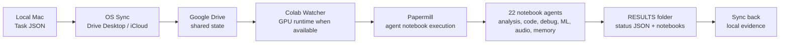

# Autowatcher v7.0 - Zero-Cost Cloud Compute Bypass

## What this evidence shows

I designed the Autowatcher as a way to bypass local hardware constraints without building a paid cloud backend first. The system uses consumer sync infrastructure as the transport layer: tasks are written locally, synced into Drive, consumed by a Colab daemon, executed through notebook agents, and synced back as result artifacts.

## Source excerpts in this folder

- `watcher_config_agent_registry.md` shows the v7.0 agent registry, runtime settings and 22-agent notebook map.
- `papermill_task_execution_loop.md` shows task loading, agent selection, parameter injection and execution through Papermill.
- `local_runner_and_manifest.md` shows that the system was framed as a persistent AI work environment rather than a one-off notebook.

## Why it matters

This is not only an agent list. The valuable engineering signal is the infrastructure pattern:

- task files as the API,
- cloud sync as a message broker,
- notebooks as execution units,
- Drive as persistent shared state,
- memory/retry/cost/scheduler/notification modules as reliability layers,
- local runner as fallback when Colab is not the correct runtime.

## Claim boundary

This does not claim production-grade cloud reliability. It shows a resourceful, working systems pattern for orchestrating multi-agent compute under real hardware and budget constraints.

