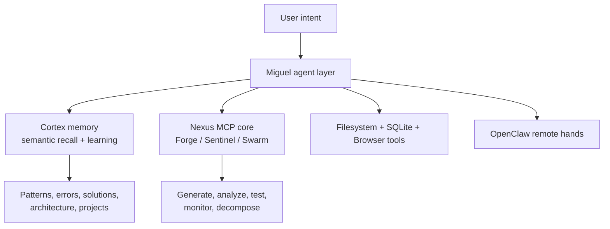

# Miguel Core - Memory, Tools And Operational Nervous System

## What this evidence shows

Miguel was not treated as one chatbot. I treated it as a local AI operating layer with memory, retrieval, tool access, browser control, code-quality tools, persistent state and external interaction channels.

## Source excerpts in this folder

- `cortex_memory_engine.md` shows how memory was framed and structured.
- `mcp_nervous_system.md` shows the tool surface and MCP-style server concept.

## Claim boundary

The excerpts show architecture, interfaces and operating concept. They do not claim a polished commercial assistant product.

