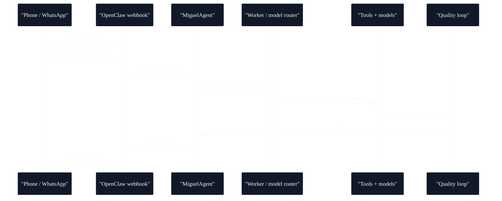

# Remote Control - OpenClaw And WhatsApp Handoff

## What this evidence shows

The system turns mobile messages into bounded agent work orders. A phone message enters through WhatsApp/OpenClaw, becomes structured intent, routes into a local agent stack, delegates tool-rich execution to a worker layer and returns only after a quality gate accepts the result.



## Original excerpt

Source label: `MIGUEL-BRAIN-MERGED / tools.md`

```text
# OpenClaw Reference - Miguels Haende

OpenClaw ist nicht ein Tool. Es sind Miguels HAENDE.
```

```text
OpenClaw Server (:18789)
|-- Browser Engine - Headless Chromium via REST API
|-- Agent Mode - Autonome Browser-Aufgaben
|-- Message System - WhatsApp, Telegram, Discord Integration
|-- Session Management - Cookies, Login-States, Contexts
`-- Config - ~/.openclaw/openclaw.json
```

```text
WhatsApp flow:
1. WA message inbound -> OpenClaw webhook
2. Ack in 2s via Ollama "Miguel ist dran."
3. EXOVIUM watcher recognizes web-inbound
4. MiguelAgent understands message (Gemini Flash -> JSON)
5. Work Order -> EXOVIUM smart model routing
6. Result -> Quality Loop (max 3x)
7. OpenClaw sends WA reply when satisfied
```

## Redactions

Phone numbers, local machine details and private config paths were not published.

## Engineering signal

This is a concrete remote-operations loop: mobile input, webhook capture, intent parsing, model/tool orchestration, quality gate and return message.
