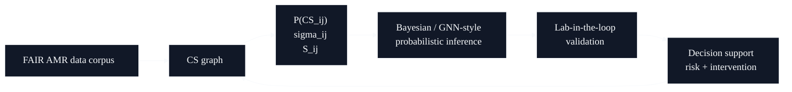

# ECSA / Predictive AMR - AI For Science Proof Of Concept

## What this evidence shows

The ECSA project frames antimicrobial resistance as a probabilistic state and graph problem, not as a molecule-search shortcut. The technical center is uncertainty-aware collateral sensitivity modeling, lab-in-the-loop validation and regulatory readiness.



## Original excerpt - ECSA blueprint

Source label: `Predictive AMR Architecture ECSA Blueprint`

```text
The ECSA Framework

complete actionable strategic blueprint for probabilistic collateral sensitivity
modelling, graph-based AMR intelligence and EU-ready regulatory design.
```

```text
The central shift is from deterministic molecule hunting to probabilistic
resistance steering.
```

```text
What ECSA builds:
- FAIR-compatible AMR and CS data corpus
- probabilistic graph model with P(CS_ij), sigma_ij, S_ij
- lab-in-the-loop validation cycle
- compliance layer for AI Act, MDR/SaMD, ISO logic
```

## Original excerpt - antibiotic project text

Source label: `Antibiotikum`

```text
AMR is one of the biggest scientific, clinical and social challenges.
Resistance development is a probabilistic evolutionary system behavior.
```

```text
ECSA goals:
- FAIR-compatible corpus
- probabilistic graph model quantifying uncertainty and stability of CS relationships
- lab-in-the-loop validation
- open research infrastructure for a European AMR knowledge base
- KPIs: Gold Data >25% by year 3, uncertainty intervals reduced >=40%,
  TRL validation to stage 5
```

## Claim boundary

This is presented as a high-stakes AI-for-science architecture and proof-of-concept direction, not as a clinically validated medical product.
