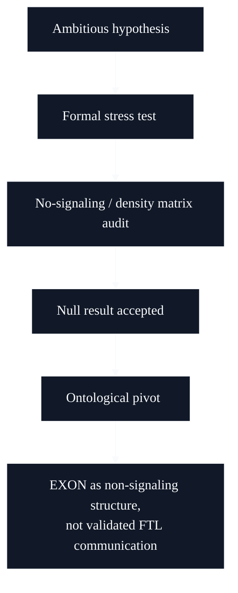

# EXON / Quantum - Red-Team And Falsification Case Study

## What this evidence shows

EXON is included because it documents epistemic restraint. I pushed a speculative quantum communication idea through a falsification process, accepted the no-signaling boundary, and preserved the surviving methodological residue instead of overstating the result.



## Original excerpt

Source label: `EXON Quantum Journey International Showcase Edition`

```text
RESEARCH & ADVERSARIAL RED-TEAMING CASE STUDY
```

```text
Adversarial Stress-Testing & Ontological Pivot

The value lies in the method:
build model, define criterion, accept break, reconstruct what survives.
```

```text
The phase-manipulation model asks if entanglement plus non-destructive
receiver readout could produce Bob-only locally distinguishable effect.
```

```text
No-signaling, density-matrix completeness and local CPTP evolution show exact
null result.
```

```text
Does not claim:
- no validated FTL channel
```

## Engineering signal

The important signal is not that the original hypothesis survived. It did not. The signal is the discipline to falsify it, keep the boundary explicit and convert the work into a clean red-team case study.
